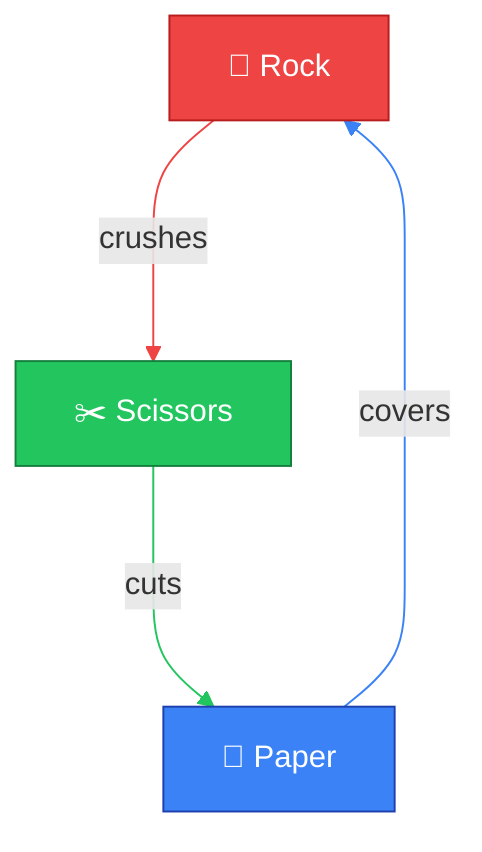
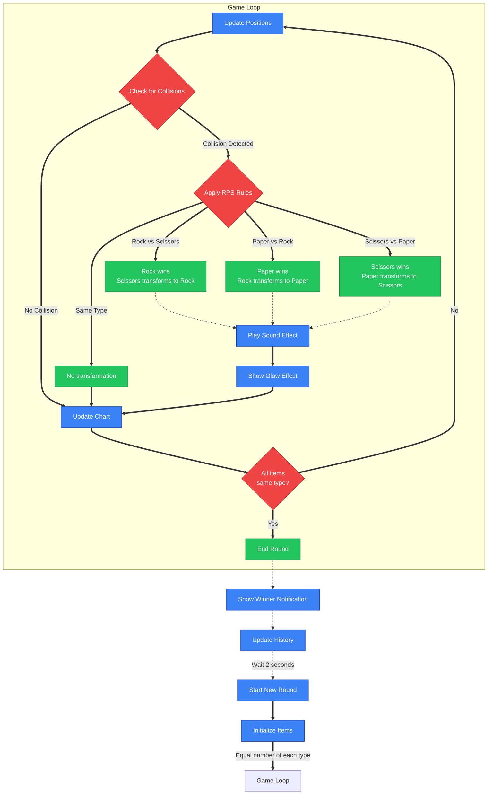

# 🎮 RPS Battle Simulator

An interactive Rock-Paper-Scissors battle simulator with real-time visualization.

## 🚀 Features

- **Dynamic Simulation**: Watch rock, paper, and scissors battle it out in real-time
- **Interactive Controls**: Adjust item count, speed, size, and refresh rate
- **Live Statistics**: Monitor the population distribution through a real-time chart
  - Population count for each type over time
  - Color-coded lines with emoji indicators (🗿, 📰, ✂️) displayed at the end of each line on the chart
  - Population count labels showing current values
  - Automatic scaling based on population size
- **Battle History**: Keep track of previous rounds with detailed statistics
- **Audio Feedback**: Hear transformation sounds as items convert each other
- **Responsive Design**: Works on desktop and mobile devices

## 🎯 How It Works

RPS Battle simulates a population of rock, paper, and scissors items that move around freely in a contained environment. When two items collide, the winner converts the loser based on classic Rock-Paper-Scissors rules:

- 🗿 Rock crushes ✂️ Scissors
- 📰 Paper covers 🗿 Rock
- ✂️ Scissors cuts 📰 Paper

The simulation continues until only one type remains, at which point a winner is declared and a new round begins automatically.

### Game Rules Visualization

### Simulation Flow Diagram

## 🎛️ Controls

### Main Controls
- **Toggle Sound**: Mute or unmute sound effects
- **Toggle Chart**: Show or hide the distribution chart
- **Toggle History**: Show or hide battle history
- **Toggle Settings**: Show or hide the settings panel

### Settings Panel
- **Item Count**: Adjust the number of each item type (1-20)
- **Speed**: Control how fast the items move (0.5x-3x)
- **Size**: Change the size of the items (15-60)
- **Refresh Rate**: Set how often the chart updates (0.1s-10s or real-time)
- **Restart**: Start a new round with the current settings

### Variations
The simulator includes multiple themed variations of the Rock-Paper-Scissors game:

- **Classic**: 🗿 Rock, 📰 Paper, ✂️ Scissors
- **Elements**: 🔥 Fire, 💧 Water, 🌿 Leaf
- **Space**: 🚀 Rocket, 🪐 Planet, ☄️ Comet
- **Weather**: ☀️ Sun, 🌧️ Rain, ❄️ Snow
- **Animals**: 🐯 Tiger, 🐺 Wolf, 🦊 Fox
- **Food**: 🍔 Burger, 🍕 Pizza, 🌮 Taco
- **Technology**: 💻 Computer, 📱 Phone, 📷 Camera
- **Emotions**: 😀 Happy, 😠 Angry, 😱 Scared

Each variation maintains the same cyclical relationship but with themed elements. The relationship diagram displays the elements in a triangle formation with curved outward-facing arrows showing the relationship between them, just like in the screenshot.

## �� Technical Details
